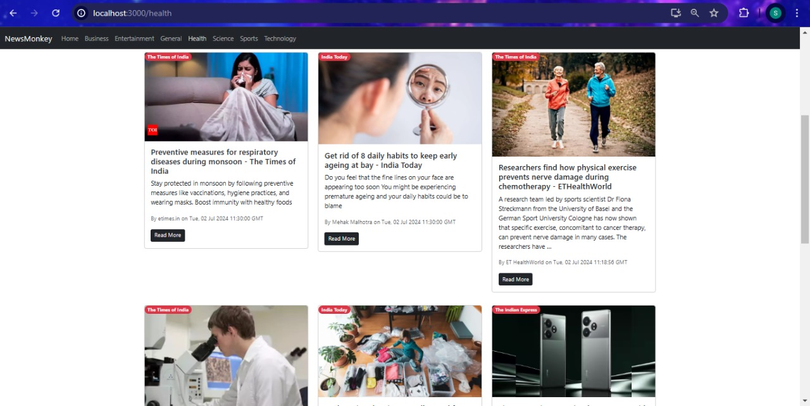
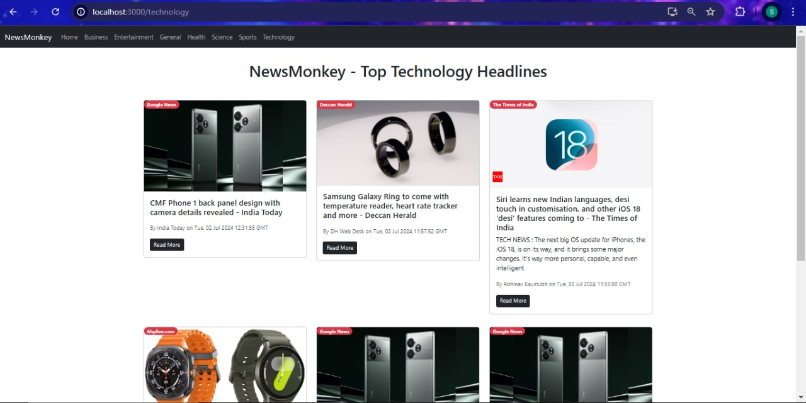
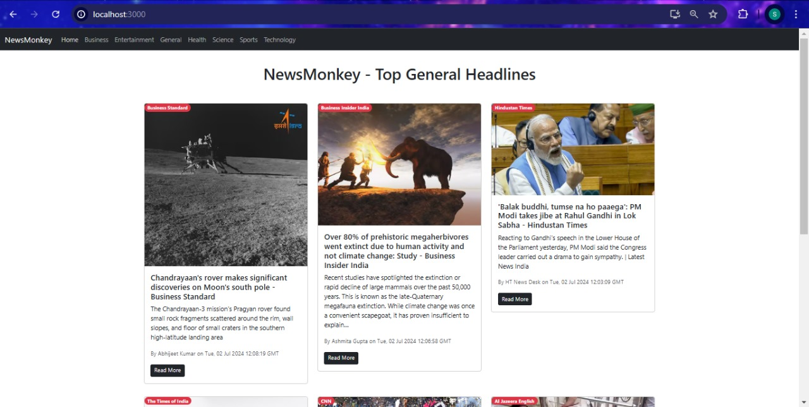

# MonkeyNews App

MonkeyNews App is a live news website using React that displays live news updates across various categories such as Home, Business, Entertainment, General, Health, Science, Sports, and Technology. The app fetches data from a news API and displays the latest news articles in a user-friendly interface.

## Screenshots





- Visit the project website [here](https://monkeynews.azurewebsites.net/).

## Features

- **Home**: Displays the latest general news headlines.
- **Business**: Shows the latest news in the business world.
- **Entertainment**: Keeps you updated with the latest entertainment news.
- **General**: General news across various topics.
- **Health**: Latest news in the health sector.
- **Science**: Updates on the latest scientific discoveries and research.
- **Sports**: Latest sports news and updates.
- **Technology**: News on the latest technology trends and updates.

## Prerequisites

Before you begin, ensure you have met the following requirements:

- You have installed the latest version of Node.js and npm.
- You have a news API key from a service like NewsAPI.

## Usage

To start the development server, run:

```sh
npm start
