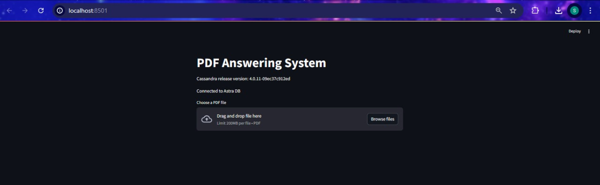
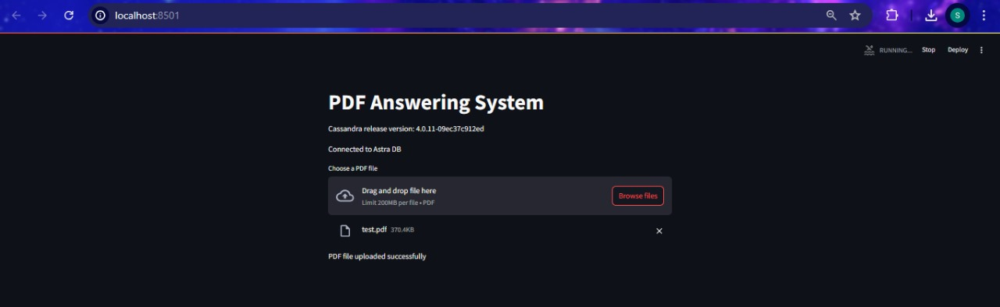
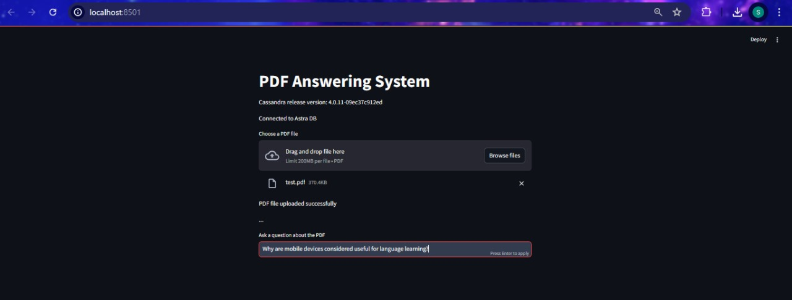
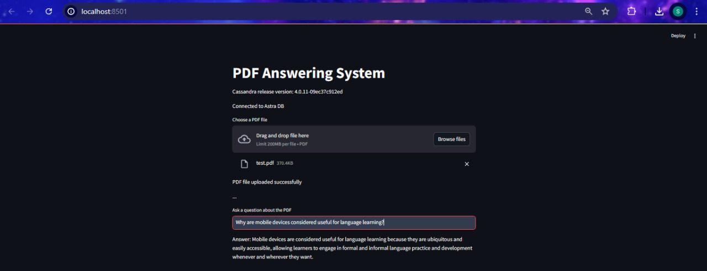

# PDF Answering System with LangChain, Cohere, and Cassandra

This project demonstrates a Streamlit application that allows users to upload PDF files, process their content, and query information using Cohere embeddings and LangChain. The content is stored in a Cassandra database, and the application provides answers to user queries about the PDF content.

## Screenshots 
Here are some screenshots of the application in use:







## Prerequisites

Before running the application, make sure you have the following:
- Python 3.8 or later installed.
- Required Python packages installed.
- A `.env` file with the necessary environment variables set.
- A secure connect bundle and a token JSON file for Cassandra.

## Setup

1. **Install the required packages**:
    ```bash
    pip install -r requirements.txt
    ```

2. **Create a `.env` file** with the following content:
    ```env
    CLIENT_ID=<your_client_id>
    CLIENT_SECRET=<your_client_secret>
    COHERE_API_KEY=<your_cohere_api_key>
    ASTRA_DB_TOKEN=<your_astra_db_token>
    ASTRA_DB_ENDPOINT=<your_astra_db_endpoint>
    ```

3. **Prepare your secure connect bundle**:
    Place the `secure-connect-sumeet.zip` file in the same directory as your script.

4. **Prepare your token JSON file**:
    Place the `sumeet-token.json` file in the same directory as your script. This file should contain:
    ```json
    {
        "clientId": "<your_client_id>",
        "secret": "<your_client_secret>"
    }
    ```

## Running the Application

1. **Run the Streamlit application**:
    ```bash
    streamlit run app.py
    ```

2. **Upload a PDF file** using the file uploader provided in the Streamlit interface.

3. **Ask questions** about the uploaded PDF content using the text input box provided.

## Notes

- Ensure your Cassandra database and keyspace are set up correctly.
- Adjust the script as necessary to fit your specific use case.

## Troubleshooting

- If you encounter any errors related to database connection, check your secure connect bundle and token file.
- Ensure your environment variables are correctly set in the `.env` file.
